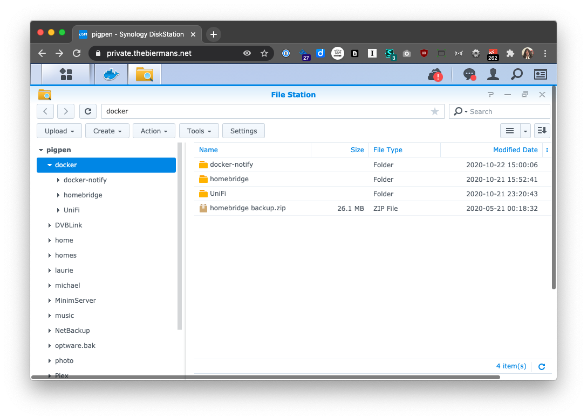
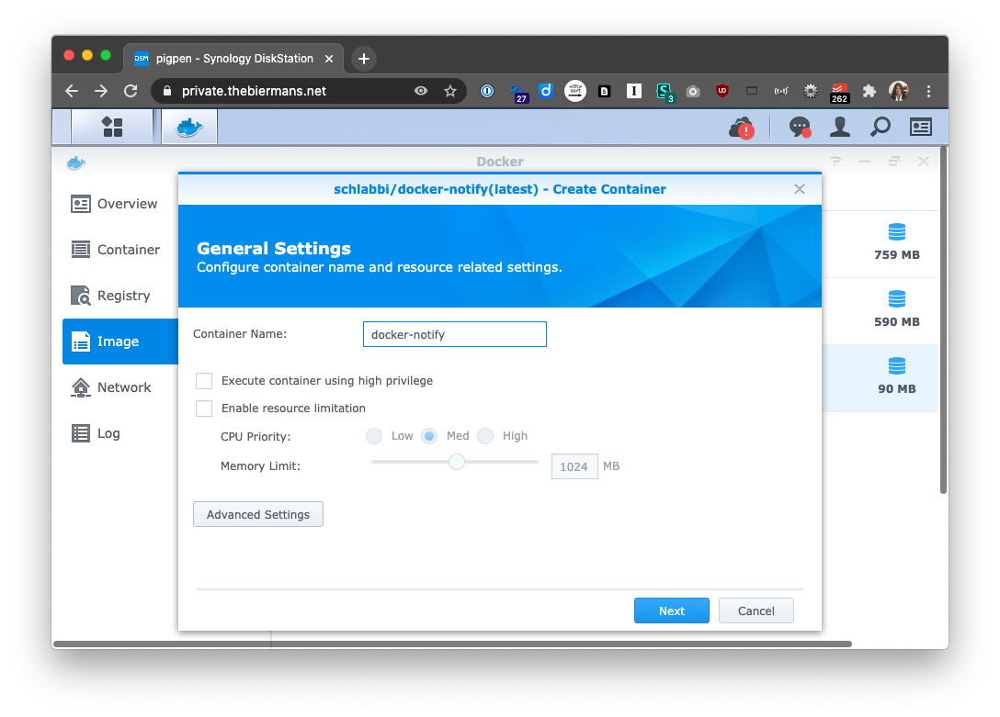
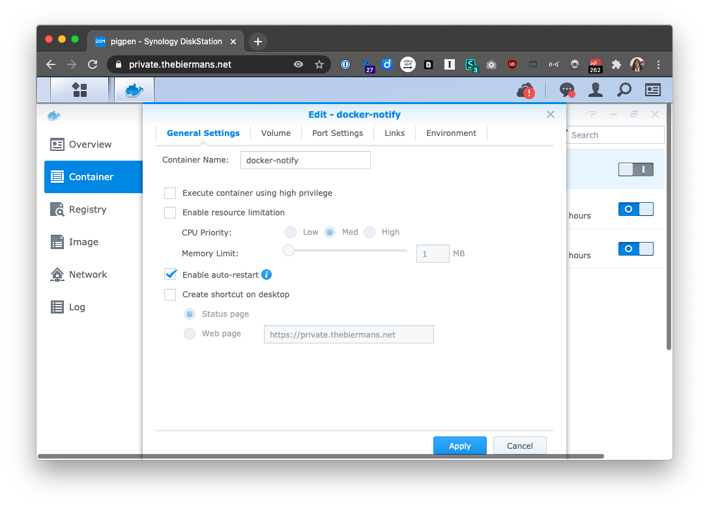
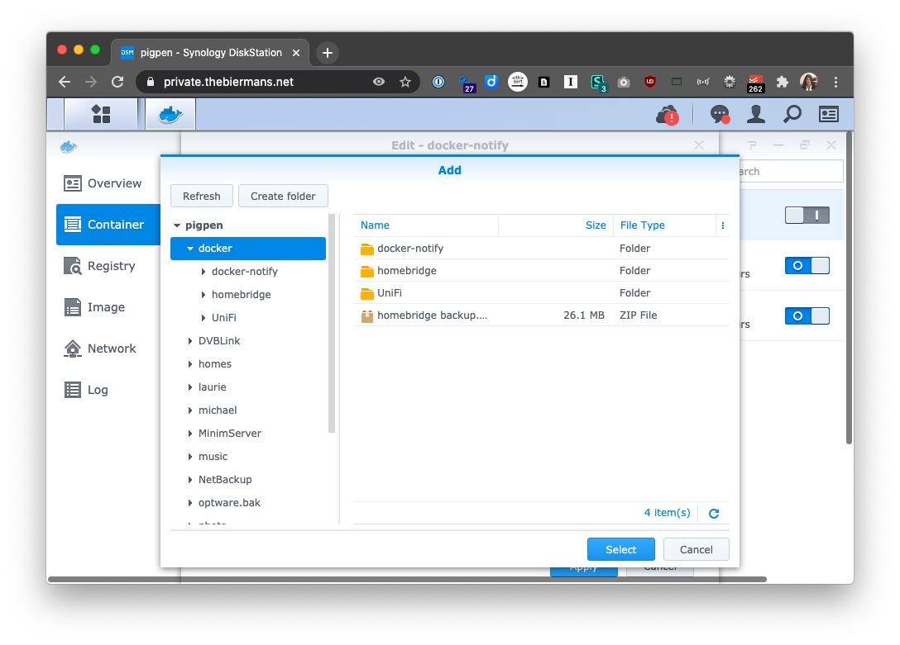
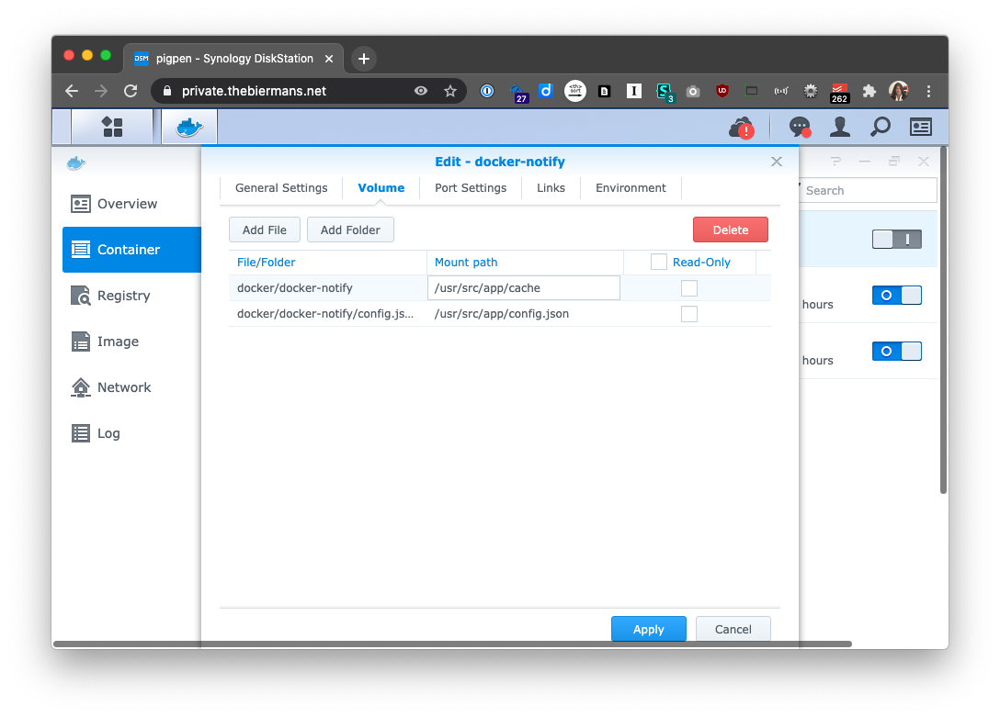
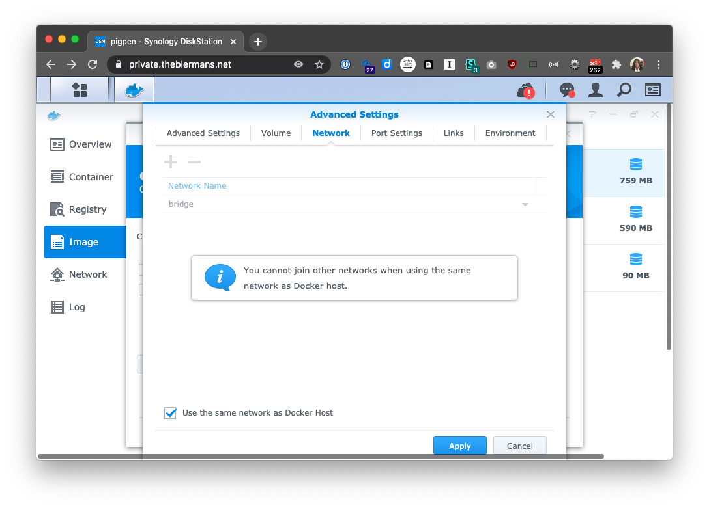
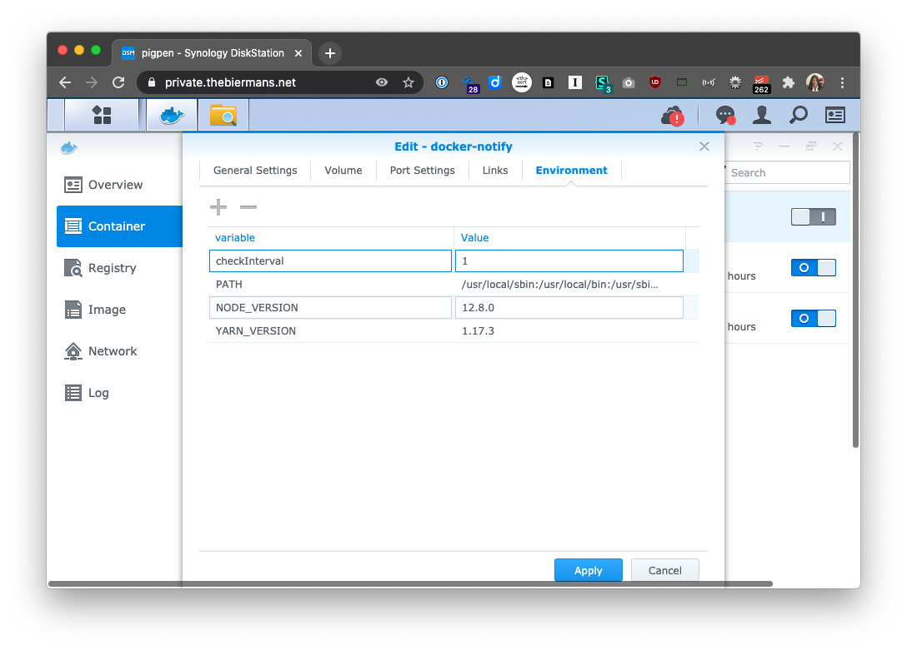
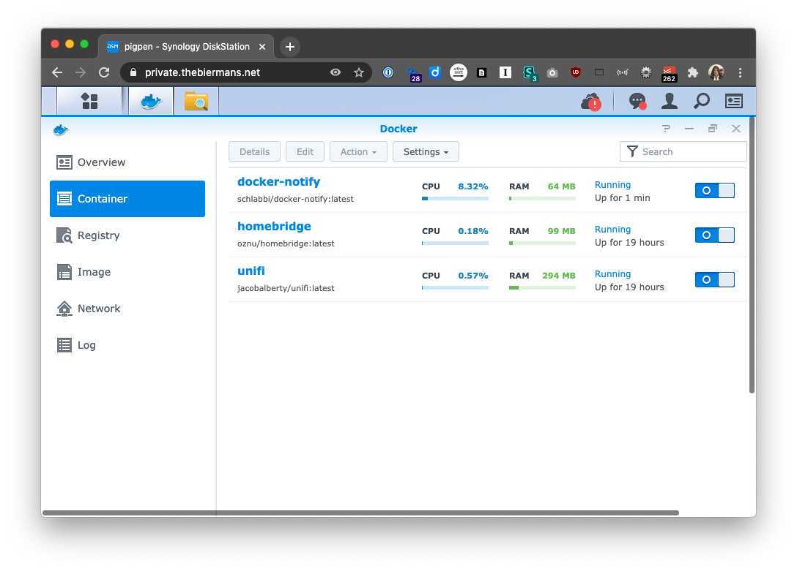

## How to setup docker-notify & Docker on a Synology NAS

This guide will show you how to run the [docker-notify](hhttps://github.com/Schlabbi/docker-notify) docker image on a Synology NAS running DSM 6.

# Requirements

* A [Docker compatible Synology NAS](https://www.synology.com/en-global/dsm/packages/Docker)
* Disk Station Manager 6+

# Installing Docker on Synology DSM

Install the Docker app using the Synology DSM [Package Center](https://www.synology.com/en-global/dsm/packages/Docker).


### 1. Create your docker directory.
Using a terminal or your DSM File Station, create a new empty folder to store your docker-notify configuration in.  This will allow you to update, delete and recreate containers without loosing any personal configuration. Since you may have more than one Docker container, you might want first a folder for all your docker containers and then a folder for each container. So in this case, ```docker/docker-notify```. If you already have docker running, just create a docker-notify directory inside the folder where you store your other dockers.




### 2. Set your ```config.json``` file.
This is no different on Synology than [any other platform](https://github.com/Schlabbi/docker-notify).

Place your ```config.json``` file in the folder you defined earlier, ```docker/docker-notify``` in the previous step.

It is a good idea to validate your ```config.json``` using a tool like ```https://jsonlint.com/?code=``` to be sure it is ready before starting. Any error in you config.json may cause the container to continuously restart. You can also use the [example config.json](https://github.com/Schlabbi/docker-notify/blob/master/config.json.example) as a test and once you know the container is working, stop the container, replace the config.json with your own, and then restart the container. 

### 3. Create a ```cache``` folder. 
In the folder you defined earlier, ```docker/docker-notify``` create a folder called, ```cache```.


### 4. Download the Docker image.
Open the Docker app on your Synology DSM, go to the `Registry` section and then search for and download the [chlabbi/docker-notify](https://github.com/Schlabbi/docker-notify) image.


Make sure you select the `latest` tag when you have the option. 


## 5. Create Container.
When the container download is complete, launch a new container using the [chlabbi/docker-notify](https://github.com/Schlabbi/docker-notify) image.


## 6. Name your container.
Choose a name and then click ```Advanced Settings```:




## 7. Configure Advanced Settings.
Check the box to ```Enable auto-restart```. This is recommended if you want your container to automatically restart after your Synology DSM reboots or if docker-notify crashes.




## 8. Configure the Volume tab.
Click the ```Volume``` tab and then **Add Folder**.




Choose the folder— ```docker/docker-notify``` used in this example, and set the **Mount path** to be ```/usr/src/app/cache```.

Next, add **a file** with the mount path as ```/usr/src/app/config.json``` as shown which connects to the config.json file you created previously.



## 9. Configure the Network tab.
Click the ```Network``` tab and check the box to ```Use the same network as Docker host```. 



## 10. Configure Environment (optional).
Click the ```Environment``` tab and add a new environment variable named `checkInterval`. The value of the `checkInterval` defines in hours, how often checks will be made for new container releases.



Click ```OK``` to save your advanced settings and then click ```Apply``` to start the [Schlabbi/docker-notify](https://github.com/Schlabbi/docker-notify) container.




# Updating ```docker-notify``` on Synology

To update to the latest version of ```docker-notify``` container, go to the Docker app in Synology. 

1. On the `Container` tab stop the existing docker-notify container (Select the container, then Action > Stop).
1. Edit the existing container and change it's name to `docker-notify-old`.
1. Go to the `Image` tab. Note the tag of the docker image you have been using. Probably `latest`. You will need to know this for the following steps.
1. Delete that image. (Note Synology Docker may not let you delete the image if it is associated with a container. If that's the case, continue on to the next step.)
1. Go to the `Registry` tab and find `chlabbi/docker-notify` by searching for `docker-notify`. Choose the same tag that you saw in the step above.
1. [Download the that Image](#1-download-docker-image)
1. When the image download is complete, go to the `Container` tab and select `docker-notify-old` then click `Settings` then `Duplicate settings`. 
1. Rename the container `docker-notify`.
1. Start the `docker-notify` container.
1. Delete the `docker-notify-old` container once you have confirmed everything is working.